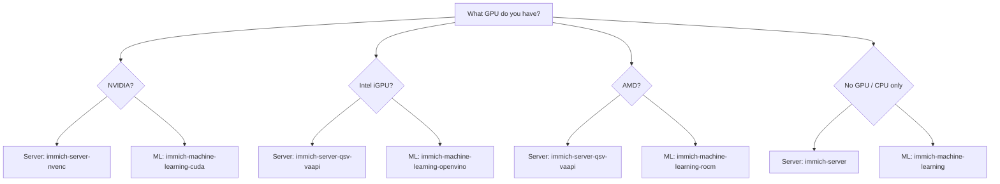

[](https://creativecommons.org/licenses/by/4.0/)
[](https://immich.app)
[](https://unraid.net)
[](https://www.postgresql.org)
[](https://github.com/tensorchord/VectorChord)
[](https://valkey.io)


# Table of Contents
- [Unraid Immich Performance Setup + Google Takeout Guide](#unraid-immich-performance-setup--google-takeout-guide)
- [Note](#note)
- [Intended Use](#intended-use)
- [Installation and Configuration](#installation-and-configuration)
  - [Pre-Work: Google Takeout Phase 1 - Request Export](#pre-work-google-takeout-phase-1---request-exporting-your-photos-from-google-photos)
  - [Step 1: Create Shares](#step-1-create-shares-immich-and-immich-gen-for-immich-on-unraid)
  - [Pre-Work: Google Takeout Phase 2 - Download via Firefox](#pre-work-google-takeout-phase-2---downloading-and-extracting-your-photos-from-google-takeout-utilizing-a-firefox-docker-container-on-unraid)
  - [Step 2: Create Docker Network](#step-2-create-the-immich_internal-docker-network)
  - [Step 3: Choose Your Platform](#step-3-choose-your-platform)
  - [Step 4: Download Templates](#step-4-download-templates)
  - [Step 5: PostgreSQL](#step-5-postgresql)
  - [Step 6: Valkey Setup](#step-6-valkey-setup)
  - [Step 7: Machine Learning Setup](#step-7-machine-learning-setup)
  - [Step 8: Immich Server Setup](#step-8-immich-server-setup)
  - [Step 9: Container Start Order](#step-9-container-start-order-with-folderview3)
  - [Step 10: Run and Verify](#step-10-run-and-verify)
  - [Pre-Work: Google Takeout Phase 2.5 - Extract Archives](#pre-work-google-takeout-phase-25---extract-tar-archives)
  - [Google Takeout Phase 3: PhotoMigrator](#google-takeout-phase-3-photomigrator)
- [Cleanup](#cleanup)
- [FAQ](#faq)
- [TODO](#todo)
- [Kudos and Credits](#kudos-and-credits)


## Unraid Immich Performance Setup + Google Takeout Guide
### TL;DR:
#### Immich Setup
We use a share living on the Cache (SSD/NVMe) for `encoded-video`, `profile` and `thumbs` - and a HDD share living on the Array for `backups`, `library` and `upload`. This setup allows us to leverage the speed of the Cache for frequently accessed data while utilizing the Array for long-term storage of original media files.
Plus we use a custom network for better performance and security, avoiding an overhead of the default `bridge` network.

#### Google Takeout Guide
Also for the migration from Google Photos to Immich, we use Google Takeout to export our photos and videos, and then utilize a Firefox Docker container on Unraid to download the exported files directly to our Unraid server, avoiding the need to download them to a local machine first.
We'll be using PhotoMigrator to automate the process of importing photos from our Google Takeout export into Immich. PhotoMigrator takes care of handling metadata and organizing the photos in the correct structure for Immich.

## Note
If you're unsure about using Immich, you can try it out on [PixelUnion](https://pixelunion.eu) (non-sponsored).

Just a friendly recommendation to test Immich without setting it up yourself first. You can create a free account with 16GB included storage and upload a few photos to see how the interface works and if it meets your needs before going through the setup process on Unraid.

---

## Intended Use
**READ THROUGH BEFORE STARTING YOUR SETUP.**
### In Scope:
This guide is intended for NEW setups of Immich on Unraid.

### Out of Scope:
Upgrading existing Immich setups as it requires significant changes to the existing setup and *data migration*.
If you have an existing Immich setup on Unraid and want to optimize it for better performance, I would recommend **backing up your data**, setting up a new instance of Immich following this guide and then migrating your data from the old instance to the new one.

*If you REALLY want to upgrade: Consult the Immich documentation and community for best practices on how to do this migration to ensure that you don't lose any data in the process. Happy learning!*

## What's inside this repository?
This repository contains a step-by-step guide for an optimal setup of Unraid for Immich, a self-hosted photo and video management application. The guide covers Unraid configuration WITHOUT using Docker Compose for a more Unraid-native approach and also performance optimization tips to ensure a smooth and efficient experience with Immich on Unraid.

**AGAIN:** This guide is intended for users who want to run a *NEW instance of Immich* on Unraid and are looking for best practices to achieve optimal performance and to ensure that your setup is running efficiently and effectively.

---

### Pre-requisites
- 2 hours of time to set up and configure everything (depending on your familiarity with Unraid and Docker, it may take more or less time)
- Unraid Server with Docker support
- Basic understanding of Unraid and Docker
- Knowledge how to add a Docker Container to a (custom) docker network
- Unraid Community Applications plugin installed
- A SSD/NVMe drive for Cache (can be your Unraid Cache drive)
  - 7-10GB for the Immich machine learning container to store ML models and cache
- Very basic Terminal/Command Line knowledge for Unraid
- If you want to migrate from Google Photos to Immich: Google Account with photos stored in Google Photos
- Triple the space of your Google Photos library available on your Unraid server for the migration process.
  Example: 100GB of Google Takeout Photos * 3 = 300GB
  -> 100GB for the compressed files, 100GB for the extracted files, 100GB for the final library after migration.

**HINT:** Not required but a sanity check - If you want to opt-out of Google Photos (=destroy your Google Photos library) and start with Immich, make sure to have healthy disks. It *might* be a good idea to run a SMART test on your disks and check the health status before you start uploading your photos to Immich to avoid any potential data loss due to disk failure during the upload process. 

---

# Installation and Configuration
## Pre-Work: Google Takeout Phase 1 - Request Exporting Your Photos from Google Photos
Before you can get your photos into Immich, you need to get them out of Google Photos.
If you have a large library, the Google Takeout exporting process can take a while (from my experience for 100GB half a day), so it's best to get it started as soon as possible.

**Purpose:** You can use Google Takeout to export your photos and videos from Google Photos including metadata.
For exporting from Google Takeout, you can choose between a `zip` and `tar`  file that you can extract and then using tools to upload to Immich.

Depending on:
- Your internet connection speed
- possibly metered internet connection (some ISPs throttle download speeds after a certain amount of data downloaded)

... choose between `zip` and `tar` for your export.

**The convenient choice: `zip` (recommended)**

`zip` has a larger file size but is supported by PhotoMigrator out of the box, *taking care of the extraction process*. See chapter [Google Takeout Phase 3: PhotoMigrator](#google-takeout-phase-3-photomigrator) for more details.

**The smaller and faster choice: `tar`**

But if you have a large library and/or slower internet speed, I would recommend choosing `tar` for better compression and faster extraction times. You can easily extract `tar` files on Unraid using the terminal or a Docker container. We got that step covered in chapter [Pre-Work: Google Takeout Phase 2.5 - Extract tar Archives](#pre-work-google-takeout-phase-25---extract-tar-archives).

1. Go to [Google Takeout](https://takeout.google.com/)
2. Sign in to your Google account
3. Deselect all products using the "Deselect all" option
4. Then scroll down or search for "Google Photos"
5. Select only Google Photos for export.
6. Scroll to the bottom and click "Next step"

7. Choose your delivery method (e.g., "Send download link via email")
8. Choose the export frequency: "Export once"
9. Choose the file type: `zip` or `tar`
10. Choose the file size: "50GB" (Google will split the export into multiple files if your library exceeds this size.)
11. Hit "Create export" and wait for the process to complete. You will receive an email with a download link once the export is ready.

---

## Step 1: Create Shares `immich` and `immich-gen` for Immich on Unraid
Open up your Unraid web interface and using the top navigation menu, navigate to the "Shares" tab.
Here, we will create two shares: one for the main media library and another for generated files.
Click on "Add Share" on the bottom left of your Share table and create the following shares:

### `immich` Share
**Data storage:** *Array (HDD)*

**Purpose:** *This share will be used to store your photo and video library, as well as backups and uploads. It will be the main storage location for your media files.*

- **Share name:** `immich`
- **Comments:** `Immich photo and video library, as well as backups and uploads.`
- **Minimum free space:** `10GB` 
  (you can adjust this based on your needs - Setting too low may lead to issues with uploads and backups if the share runs out of space)
- **Primary storage (for new files and folders):** `Array`
- **Allocation method:** `High-Water`
- **Split level:** `Automatically split any directory as required`
- **Included disk(s):** `All` 
  (BUT you can exclude disks if you want to dedicate specific disks for other purposes or if you have a mix of HDDs and SSDs in your array and want to keep the immich share on the HDDs. Also usable if you've got untrusted disks in your array that you don't want to use for immich storage.)
- **Excluded disk(s):** `None`

-> Hit "Add Share" to create the share.


### `immich-gen` Share
**Data storage:** *Cache (SSD/NVMe)*

**Purpose:** *This share will be used to store **gen**erated files like thumbnails and encoded videos. Also your profile lives here.*

- **Share name:** `immich-gen`
- **Comments:** `Immich generated files (thumbnails, encoded videos) and profile.`
- **Minimum free space:** `10GB` 
  (you can adjust this based on your needs - Setting too low may lead to issues with thumbnail generation and video encoding if the share runs out of space)
- **Primary storage (for new files and folders):** `Cache`
- **Secondary storage:** `Array` 
  (HDD - this is a fallback in case the cache runs out of space, but ideally, you want to keep the immich-gen share on the cache for optimal performance)
- **Allocation method:** `High-Water`
- **Split level:** `Automatically split any directory as required`
- **Included disk(s):** `All` 
  (BUT you can exclude disks if you want to dedicate specific disks for other purposes or if you have a mix of HDDs and SSDs in your array and want to keep the immich share on the HDDs. Also usable if you've got untrusted disks in your array that you don't want to use for immich storage.)
- **Excluded disk(s):** `None`
- **Mover actions:** `Cache -> Array`

-> Hit "Add Share" to create the share.

---

## Pre-Work: Google Takeout Phase 2 - Downloading and Extracting Your Photos from Google Takeout utilizing a Firefox Docker Container on Unraid
Once you receive the email from Google Takeout with the download link, you can use a Firefox Docker container on Unraid to download the exported files directly to your Unraid server. 

**Purpose:** This method is especially useful if you have a large library, slower download speed and to avoid downloading the files to your local machine first and moving it to Unraid.

1. Go to the "Apps" tab in your Unraid web interface
2. Search for "Firefox" in the Community Applications.
3. Choose the Firefox container by LinuxServer.io and click "Install".
4. If you already have a Firefox container setup, choose to name the new container something like "firefox-takeout-export" to differentiate it from any other Firefox containers you may have.
5. During the installation process, scroll down and click on `Add another Path, Port, Variable, Label or Device`
6. To map the Download Path to the `immich` share, set the "Config Type" to `Path` (It's automatically pre-set)
   1. Name: `takeout-export`
   2. Container Path: `/config/Downloads`
   3. Host Path: `/mnt/user/immich/Takeout`
   4. Access Mode: `Read/Write`
   5. --> Hit "Save" to add the path mapping
7. Hit "Apply" to start the installation of the Firefox container with the new path mapping.
8.  Open the Firefox container's web UI
9.  You may be prompted with an SSL warning since the container is using a self-signed certificate. You can safely bypass this warning by clicking on "Advanced" and then "Accept the Risk and Continue" to proceed to the Firefox web UI.
10. Go to [https://mail.google.com/](https://mail.google.com/)
11. Sign in to the Google account associated with your Google Takeout export.
12. When prompted for giving Google/Alphabet your data, click "Deny All" (or similar)
13. Open the email from Google Takeout
14. Click on the download link(s) for your export.
15. Your export files will start downloading directly to the `immich` share on your Unraid server in the `Takeout` folder that we mapped to the Firefox container.

**NOTES:**
- The download speed may vary based on your internet connection and the size of your export. Be patient, especially if you have a large library. Grab a coffee or two while you wait! :coffee:
- Sometimes the download speed may be slower than expected as you may have caught an overloaded Google Server. If you notice that the download is very slow, you can try pausing/aborting and resuming the download in the Firefox web UI to potentially improve the speed.

---

## Step 2: Create the `immich_internal` Docker Network
All Immich containers need to communicate with each other by container name. We create a dedicated Docker network for this.

1. Open the Unraid web interface
2. Open the Unraid terminal (click the `>_` icon in the top right corner of the navigation bar)
3. Run the following command to create the network:
```bash
docker network create immich_internal
```
4. When setting up each container below, select `immich_internal` as the network in the template settings.

**Why a custom network?** Containers on the default `bridge` network communicate via host port mappings (NAT overhead). On a custom network, containers resolve each other by name directly — faster and more secure since database/cache ports don't need to be exposed to the host.

---

## Step 3: Choose Your Platform
Before downloading templates, determine which GPU acceleration you want to use. This affects which **server** template (for video transcoding) and which **machine learning** template (for face recognition and image search) you need.

*Tip: Click the expand icon (↔) on the diagram to view it in full size.*



| GPU | Server Template (Transcoding) | ML Template (Inference) |
|-----|-------------------------------|------------------------|
| **None / CPU only** | `immich-server` | `immich-machine-learning` |
| **Intel iGPU** (N100, UHD, Iris) | `immich-server-qsv-vaapi` | `immich-machine-learning-openvino` |
| **AMD** (Polaris+) | `immich-server-qsv-vaapi` | `immich-machine-learning-rocm` |
| **NVIDIA** (Pascal+) | `immich-server-nvenc` | `immich-machine-learning-cuda` |

---

## Step 4: Download Templates
Open the Unraid web interface and open the terminal (click the `>_` icon in the top right corner of the navigation bar). Then download the templates you need.

**NOTE:** `wget` downloads files from the web. The `-P` flag sets the download directory. Templates are saved to Unraid's Docker Manager template directory.

### PostgreSQL
Choose between stability and latest features:

| Option | Image | VectorChord | pgvector | Status |
|--------|-------|-------------|----------|--------|
| **Stable** | `ghcr.io/immich-app/postgres:18-vectorchord0.5.3-pgvector0.8.1` | 0.5.3 | 0.8.1 | Tested by Immich team |
| Experimental | `tensorchord/vchord-postgres:pg18-v1.1.1` | 1.1.1 | 0.8.2 | Latest, less tested |

**NOTE:** You COULD use VectorChord 1.0.0+ (See [#23845](https://github.com/immich-app/immich/pull/23845)) or 1.1.1 (See [this discussion](https://github.com/immich-app/immich/discussions/23830#discussioncomment-15956803)). The 0.5.3 version is more stable and tested extensively with Immich. If you want to try the latest, use the experimental template.

#### **PostgreSQL database by Immich** — RECOMMENDED (stable, tested by Immich team):
```bash
wget -P /boot/config/plugins/dockerMan/templates-user/ https://raw.githubusercontent.com/rorar/unraid-templates/main/templates/immich-postgres-official.xml
```

#### **PostgreSQL database by VectorChord** — EXPERIMENTAL (latest VectorChord 1.1.1, less tested with Immich):
```bash
wget -P /boot/config/plugins/dockerMan/templates-user/ https://raw.githubusercontent.com/rorar/unraid-templates/main/templates/immich-vectorchord-db.xml
```

### **Valkey** (cache/message broker):
```bash
wget -P /boot/config/plugins/dockerMan/templates-user/ https://raw.githubusercontent.com/rorar/unraid-templates/main/templates/immich-valkey.xml
```

### Machine Learning template (choose one based on your GPU):

#### **CPU only** — no GPU acceleration:
*CPU inference is possible but will be much slower for tasks like face recognition and CLIP-based search. Only recommended if you have a powerful CPU and a small library. Will work but expect slower performance and high load on the CPU.*
```bash
wget -P /boot/config/plugins/dockerMan/templates-user/ https://raw.githubusercontent.com/rorar/unraid-templates/main/templates/immich-machine-learning.xml
```

#### **NVIDIA CUDA:**
```bash
wget -P /boot/config/plugins/dockerMan/templates-user/ https://raw.githubusercontent.com/rorar/unraid-templates/main/templates/immich-machine-learning-cuda.xml
```

#### **Intel OpenVINO:**
```bash
wget -P /boot/config/plugins/dockerMan/templates-user/ https://raw.githubusercontent.com/rorar/unraid-templates/main/templates/immich-machine-learning-openvino.xml
```

#### **AMD ROCm:**
```bash
wget -P /boot/config/plugins/dockerMan/templates-user/ https://raw.githubusercontent.com/rorar/unraid-templates/main/templates/immich-machine-learning-rocm.xml
```

### Server template (choose one based on your GPU):
*These templates are for video transcoding. If you don't have a GPU or don't want to use it for transcoding, choose the CPU-only template.*

#### **CPU only** — no GPU transcoding:
```bash
wget -P /boot/config/plugins/dockerMan/templates-user/ https://raw.githubusercontent.com/rorar/unraid-templates/main/templates/immich-server.xml
```

#### **Intel QSV / AMD VAAPI** — uses `/dev/dri`:
*You can also use your Intel iGPU ("inbuilt graphics card" in your CPU) for transcoding with Quick Sync Video (QSV) or your AMD GPU with VAAPI. Both use the same template since they both leverage `/dev/dri` for hardware acceleration.*
```bash
wget -P /boot/config/plugins/dockerMan/templates-user/ https://raw.githubusercontent.com/rorar/unraid-templates/main/templates/immich-server-qsv-vaapi.xml
```

#### **NVIDIA NVENC** — uses `--runtime=nvidia`:
```bash
wget -P /boot/config/plugins/dockerMan/templates-user/ https://raw.githubusercontent.com/rorar/unraid-templates/main/templates/immich-server-nvenc.xml
```

### **PhotoMigrator** (for Google Takeout migration):
```bash
wget -P /boot/config/plugins/dockerMan/templates-user/ https://raw.githubusercontent.com/rorar/unraid-templates/main/templates/photomigrator.xml
```

---

## PostgreSQL Setup (both options):
1. Go to the **Docker** tab → **Add Container**
2. Select the template you downloaded (`immich-postgres-official` or `immich-vectorchord-db`)
3. Configure:
   - **Network:** `immich_internal`
   - **POSTGRES_PASSWORD:** Set a strong password! Generate one in the terminal: `openssl rand -base64 32 | tr -dc A-Za-z0-9 | head -c 32`
   - **POSTGRES_USER:** `postgres`
   - **POSTGRES_DB:** `immich`
4. Hit **Apply** to start the container.

**IMPORTANT:** Remember/copy your `POSTGRES_PASSWORD` — you'll need the exact same value in the `immich-server` configuration.

**NOTE:** If upgrading from VectorChord 0.4.3 to 1.0.0+: See [this comment](https://github.com/immich-app/immich/pull/23845#issuecomment-3566969928).

---

## Step 6: Valkey Setup
Valkey is a Redis-compatible cache used by Immich as a message broker.

1. Go to the **Docker** tab → **Add Container**
2. Select the `immich-valkey` template
3. Configure:
   - **Network:** `immich_internal`
   - All other defaults are fine
4. Hit **Apply** to start the container.

That's it — Valkey needs no special configuration for Immich.

---

## Step 7: Machine Learning Setup
The ML service handles face recognition, CLIP-based image search, and OCR. Models are downloaded on first use and cached (several GB).

1. Go to the **Docker** tab → **Add Container**
2. Select the `immich-machine-learning` template matching your GPU (see [Step 3](#step-3-choose-your-platform))
3. Configure:
   - **Network:** `immich_internal`
   - **Path: Model Cache:** `/mnt/user/appdata/immich/model-cache/` (default is fine as long as it points to a path with an SSD/NVMe for better performance)
4. Hit **Apply** to start the container.

**NOTE:** The first startup will be slow as ML models are downloaded. This is normal.

---

## Step 8: Immich Server Setup
The main application — web UI, API, and background workers.

1. Go to the **Docker** tab → **Add Container**
2. Select the `immich-server` template matching your GPU (see [Step 3](#step-3-choose-your-platform))
3. Configure:
   - **Network:** `immich_internal`
   - **DB_HOSTNAME:** `immich-vectorchord-db` (depending on your database choice | must match the database container name)
   - **DB_PASSWORD:** The exact same password you set in [Step 5](#step-5-postgresql)
   - **REDIS_HOSTNAME:** `immich-valkey` (must match the Valkey container name)
   - All HDD/SSD storage paths should already point to the correct shares (`/mnt/user/immich/` and `/mnt/user/immich-gen/`)
4. Hit **Apply** to start the container.

Access Immich at `http://<your-unraid-ip>:2283` and create your admin account.

---

## Step 9: Container Start Order with FolderView3
Immich containers must start in the correct order. If the server starts before the database is ready, it will fail.

**Correct start order:**
1. depending on your database choice: 
   `immich-vectorchord-db` (PostgreSQL)
2. `immich-valkey` (Valkey)
3. `immich-machine-learning` (ML)
4. `immich-server` (Server — depends on all above)

To manage this on Unraid, install **FolderView3** from Community Applications:
1. Go to **Apps** → search for **FolderView3** → Install
2. Go to the **Docker** tab
3. Scroll down and click "Add Folder"
4. create a new folder called `Immich` 
5. optionally add an Immich icon using the URL https://raw.githubusercontent.com/immich-app/immich/refs/heads/main/mobile/packages/ui/showcase/web/icons/apple-icon-180.png )
6. Drag all four Immich containers into this folder in the order listed above
7. Back in **Docker** tab, click on the Immich folder and click "Start" (FolderView3 will start them in sequence when you start the folder)

---

## Step 10: Run and Verify
1. Click on the `Immich` folder in Docker and hit "Start" (this will start all containers in the correct order)
2. Wait a few minutes for the server and all dependent services to initialize
3. Access Immich at `http://<your-unraid-ip>:2283` and log in with the admin account you created
4. Verify that everything is working by uploading a test photo and checking that thumbnails are generated and that the photo appears in the library.
5. Check the logs of each container if you encounter any issues to troubleshoot.
6. **Verify GPU acceleration for Machine Learning (if applicable):**
   If you chose a GPU-accelerated ML template (CUDA, OpenVINO, or ROCm), verify that the GPU is being used:
   - Upload a photo and wait for face detection / smart search to process (the provider log appears on first model load, not on container startup)
   - Then run this command in the Unraid terminal:
   ```bash
   docker logs immich-machine-learning 2>&1 | grep -i "execution providers" | tail -1 | grep -qv "'CPUExecutionProvider'" && echo "GPU acceleration: ACTIVE" || echo "GPU acceleration: NOT ACTIVE (CPU only)"
   ```
   - If it says **NOT ACTIVE**, check your device mappings and driver setup
   - For details, check the full log: `docker logs immich-machine-learning 2>&1 | grep -i "execution providers"`
     - NVIDIA: `['CUDAExecutionProvider', 'CPUExecutionProvider']`
     - Intel: `['OpenVINOExecutionProvider', 'CPUExecutionProvider']`
     - AMD: `['MIGraphXExecutionProvider', 'CPUExecutionProvider']`
     - CPU only: `['CPUExecutionProvider']`

**Google Takeout Migration (if you don't want to migrate you're done here):**
*You'll need this step for [Quick Start Guide: Import Google Takeout Photos to Immich](#quick-start-guide-import-google-takeout-photos-to-immich) in the PhotoMigrator section.*

7. Once verified, create an API key for the admin user in Immich: 
  `Account Icon (Top right)  → Account Settings → API Keys → New API Key → Grant ALL access by "Select All" + "Create" → Copy the API-key.`
  You'll need the API key for PhotoMigrator to import your Google Takeout photos.
8. You can now move on to the next step of your Google Photos library using PhotoMigrator (see next section).

**HINT:** Delete your API-Key after the migration process to ensure that there are no security risks from having an unused API key lying around. (see [Cleanup](#cleanup) section)

---

## Pre-Work: Google Takeout Phase 2.5 - Extract `tar` Archives
*THIS STEP IS ONLY NECESSARY IF YOU CHOSE `tar` AS THE FILE TYPE FOR YOUR GOOGLE TAKEOUT EXPORT. IF YOU'VE CHOSEN `zip`, YOU CAN SKIP THIS STEP AND MOVE FORWARD TO [GOOGLE TAKEOUT PHASE 3: PHOTOMIGRATOR](#google-takeout-phase-3-photomigrator) AS PHOTO MIGRATOR CAN HANDLE ZIP FILES OUT OF THE BOX.*

Once your Google Takeout downloads are complete (see [Phase 2](#pre-work-google-takeout-phase-2---downloading-and-extracting-your-photos-from-google-takeout-utilizing-a-firefox-docker-container-on-unraid)), you need to extract them.

Open the Unraid web interface and open the terminal (click the `>_` icon in the top right corner of the navigation bar). The following commands use a `tmux` session so the extraction continues even if you close the web terminal.

First, download the extraction script:
```bash
wget -O /mnt/user/immich/Takeout/extract-takeout.sh https://raw.githubusercontent.com/rorar/immich-unraid-manual/main/scripts/extract-takeout.sh
```

Then run it inside a tmux session:
```bash
tmux new-session -s takeout 'bash /mnt/user/immich/Takeout/extract-takeout.sh /mnt/user/immich/Takeout'
```

The script extracts each archive sequentially, then verifies every file. You will see `OK` or `WARNING` per archive, and any missing files are listed individually.

**tmux tips:**
- If you close the terminal, the extraction keeps running in the background
- To reattach: `tmux attach -t takeout`
- To check if it's still running: `tmux ls`

**NOTES:**
- Extraction can take a while for large libraries. Be patient.
- After successful extraction and migration to Immich, you can delete the `.tgz` files to free up space.
- Keep the extracted files and your Google Photos library until you've verified everything imported correctly into Immich.

---

## Google Takeout Phase 3: PhotoMigrator
PhotoMigrator is a tool to help with the migration of photos from Google Takeout and other services to Immich. It automates importing photos including metadata handling and organizing files in the correct structure for Immich.

### PhotoMigrator Setup
1. Go to the **Docker** tab → **Add Container**
2. Select the `photomigrator` template
3. Configure the volume mappings:

| Container Path | Host Path | Purpose |
|----------------|-----------|---------|
| `/app/config` | `/mnt/user/appdata/photomigrator/config` | Config files (Config.ini, docker.conf) |
| `/app/data/admin` | **`/mnt/user/immich/Takeout`** | Your extracted Google Takeout files |

4. Set **Network** to `immich_internal` (so PhotoMigrator can reach Immich by container name)
5. Hit **Apply** to start the container.
6. Access the PhotoMigrator web UI at `http://<your-unraid-ip>:6078`

**NOTE:** The mount target is `/app/data/admin` because PhotoMigrator's file browser uses per-user subdirectories. The default `admin` user browses under `/app/data/admin/`. With this mapping, your Takeout files are directly accessible via the `···` browse button → "Home (data)" in the web UI.

### Quick Start Guide: Import Google Takeout Photos to Immich
1. Open the PhotoMigrator web UI at `http://<your-unraid-ip>:6078`
2. Login with default credentials — User: `admin` / Password: `admin123`
3. Go to **Configuration Panel** → **Feature Config** → **Immich Photos**
4. Fill out:
   - **IMMICH_URL:** `http://immich-server:2283` (uses container name since both are on `immich_internal`)
   - **IMMICH_API_KEY_ADMIN:** Create an API key in Immich first: Account Icon → Account Settings → API Keys → New API Key → Grant ALL access → Copy the key
5. Click **Save config** to save your Immich connection settings.
6. Go to **Features Selector** → select the **GOOGLE TAKEOUT** tab
7. In the **Takeout Input & Output** section, click the `···` button next to `google-takeout`
8. In the folder dialog, click **"Home (data)"**
9. Navigate into the **`Takeout`** folder (this contains your extracted `Takeout/Google Fotos/...` files)
10. Click **"Use Current"** to set the path
11. Click **Run module** to start the migration

For detailed instructions on all features and migration options, see the [PhotoMigrator documentation](https://github.com/jaimetur/PhotoMigrator).

---

## Cleanup
### Files
After you have successfully downloaded and extracted your photos from Google Takeout, you can clean up the Firefox container by deleting it and any temporary files in `/mnt/user/immich/Takeout/` that were created during the download process.
### API Keys
Remove your Immich API Key in your Account Settings-->API_KEY Keys that you created for the PhotoMigrator in the Immich web UI to ensure that there are no security risks from having an unused API key lying around.
### Google Photos
If you have verified that all your photos have been successfully migrated to Immich and you no longer need your Google Photos library, you can choose to delete your Google Photos library to free up space and ensure that you are no longer relying on Google Photos for your photo storage. 

*Make sure to double-check that everything is working correctly in Immich and that you have backups of your photos before deleting your Google Photos library.*

## FAQ
### Q: Why not use the imagegenius docker image?
**A:** The [imagegenius docker image](https://hub.docker.com/r/imagegenius/immich) is a pre-built container that includes Immich and its dependencies. For example machine learning for AMD GPUs aren't supported in the imagegenius image. Using the approach covered in this guide, you'll also get updates faster using official Immich docker images. 
Also: This guide provides a more tailored approach to setting up Immich on Unraid.
### Q: Can I use this guide to upgrade an existing Immich setup on Unraid?
**A:** This guide is intended for new setups of Immich on Unraid. Upgrading an existing setup requires significant changes and data migration. If you have an existing Immich setup, I recommend backing up your data, setting up a new instance of Immich following this guide, and then migrating your data from the old instance to the new one. Consult the Immich documentation and community for best practices on how to do this migration to ensure that you don't lose any data in the process.
### Q: What if I have a different GPU or want to use a different transcoding method?
**A:** The templates provided in this guide cover the most common GPU options (NVIDIA NVENC, Intel QSV, AMD VAAPI) as well as a CPU-only option. If you have a different GPU or want to use a different transcoding method, you can still use the CPU-only template for the server, but keep in mind that transcoding performance will be slower. Alternatively, you can try modifying one of the existing templates to work with your specific GPU or transcoding method, but this may require advanced knowledge of Docker and the specific requirements of your GPU.
### Q: Why have you chosen PATH living on the array inside `immich` share instead of cache for Firefox Downloads and processing?
**A:** *TL;DR:* This approach ensures that you have enough space for the entire Google Takeout export without running into issues with limited cache space.

The `immich` share on the array is used for storing the downloaded Google Takeout files because these files can be quite large and may exceed the capacity of the cache drive, especially if you have a large photo library. The array normally provides more storage space for these temporary files during the download and extraction process. Once the photos are imported into Immich, they will be processed and stored in the appropriate locations (e.g., thumbnails and generated files in `immich-gen` on cache, original photos in `immich` on array). 

*However*, if you have a large cache drive and prefer to use it for the download and processing of the Google Takeout files, you can modify the path mapping for the Firefox container to point to a directory on the cache instead.

### Q: Can I use Docker Compose instead of individual containers?
**A:** While Docker Compose is a popular tool for managing multi-container applications, it is not natively supported in Unraid's Docker management system. This guide is designed to work with Unraid's native Docker management for better integration and ease of use. However, if you prefer using Docker Compose, you can set it up manually by creating a `docker-compose.yml` file (for example using @starbuck93 [Gist](https://gist.github.com/starbuck93/5ce522b007f67267869afbf13d071f40)) with the appropriate configuration for the Immich stack and running it in a terminal/using the Docker Compose Plugin on Unraid. Just keep in mind that this approach may require more manual management and troubleshooting compared to using Unraid's native Docker management.
### Q: Do I need to use the custom Docker network `immich_internal`?
**A:** It is best practice to use a custom Docker network for Immich to allow containers to communicate with each other by name and to avoid the overhead of the default `bridge` network. However, if you have a specific reason for not using a custom network, you can configure the containers to use the `bridge` network and set up host port mappings for communication. Just keep in mind that this may lead to slightly reduced performance and requires exposing database/cache ports to the host, which can be a security risk.

### Q: Do I need to set ports while using `immich_internal`?
**A:** No. On a custom Docker network, containers communicate directly by container name and internal port. The database (5432), Valkey (6379), and machine learning (3003) containers do not need exposed ports - they are only accessed by the Immich server internally. Not exposing these ports is actually more secure since it prevents external access to your database and cache.
Only the Immich server needs a port mapping (2283) so you can access the web UI from your browser. 
---

## TODO
- [ ] Create script that guides users through the installation

---

## Kudos and Credits
### This a polished guide from Starbuckstech @starbuck93
Many thanks for sharing your knowledge and experience with the community! :slightly_smiling_face:
Link: https://blog.starbuckstech.com/articles/how-to-install-and-optimize-immich-on-unraid-for-faster-timeline-loading/
Link Archive.org: https://web.archive.org/web/20260416192528/https://blog.starbuckstech.com/articles/how-to-install-and-optimize-immich-on-unraid-for-faster-timeline-loading/
Gist: https://gist.github.com/starbuck93/5ce522b007f67267869afbf13d071f40
### Immich Team
Immich is an incredible open-source project that has been developed and maintained by a dedicated team of developers. Immich has quickly become one of the most popular self-hosted photo and video management applications, and it's all thanks to the hard work and dedication of the Immich team. If you find Immich useful, consider supporting the project by donating or contributing to the codebase.
Link: https://immich.app/
### PhotoMigrator Team
PhotoMigrator is a fantastic tool that has been developed to help users migrate their photos from various services to Immich. The team behind PhotoMigrator has done an amazing job creating a user-friendly and efficient tool that simplifies the migration process for users. If you find PhotoMigrator useful, consider supporting the project by donating or contributing to the codebase.
Link: https://github.com/jaimetur/PhotoMigrator/
