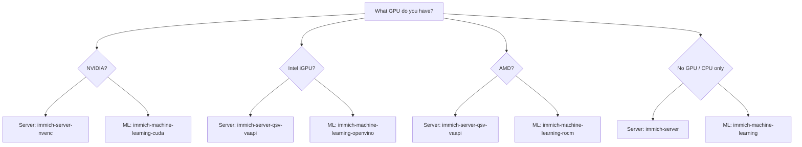

# Step 3: Choose Your GPU Platform

Before downloading templates, determine which GPU acceleration you want to use. This affects which **server** template (for video transcoding) and which **machine learning** template (for face recognition and image search) you need.

<button class="mermaid-expand-btn" onclick="openMermaidFullscreen(this)">&#x2922; Fullscreen</button>

| GPU | Server Template (Transcoding) | ML Template (Inference) |
|-----|-------------------------------|------------------------|
| **None / CPU only** | `immich-server` | `immich-machine-learning` |
| **Intel iGPU** (N100, UHD, Iris) | `immich-server-qsv-vaapi` | `immich-machine-learning-openvino` |
| **AMD** (Polaris+) | `immich-server-qsv-vaapi` | `immich-machine-learning-rocm` |
| **NVIDIA** (Pascal+) | `immich-server-nvenc` | `immich-machine-learning-cuda` |
